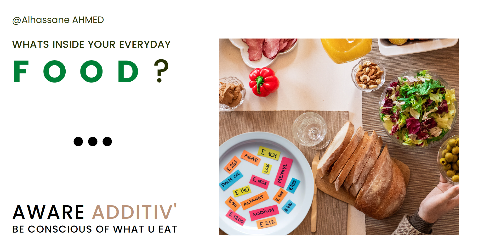

# Food Products Analysis
This analysis can be considered as :
- awareness tool for supermarket food components that could be dangerous such as additives, and the risk they could probably present for health

- recommandation tool for the healthiest possible supermarket food based on additives.

