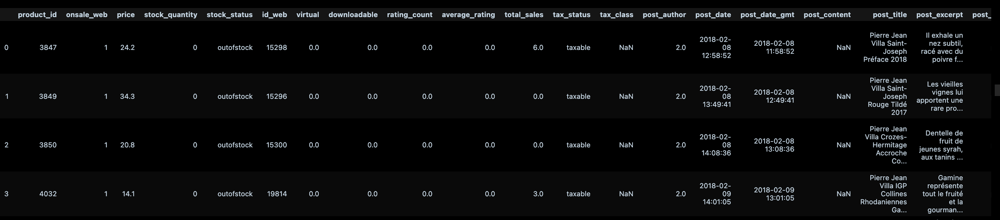

# Turnover Analysis
We have 2 databases =  Ecommerce (sales)  and ERP (stocks).

**Goal** : reconciliate the 2 databases and analyze turnover.

#### DataPrep

#### Outliers Analysis

#### Turnover Analysis

The two best-selling products achieved almost 13% of the turnover.
1. Champagne Gosset Grand Blanc de Blancs
2. Champagne Gosset Grand Rosé
