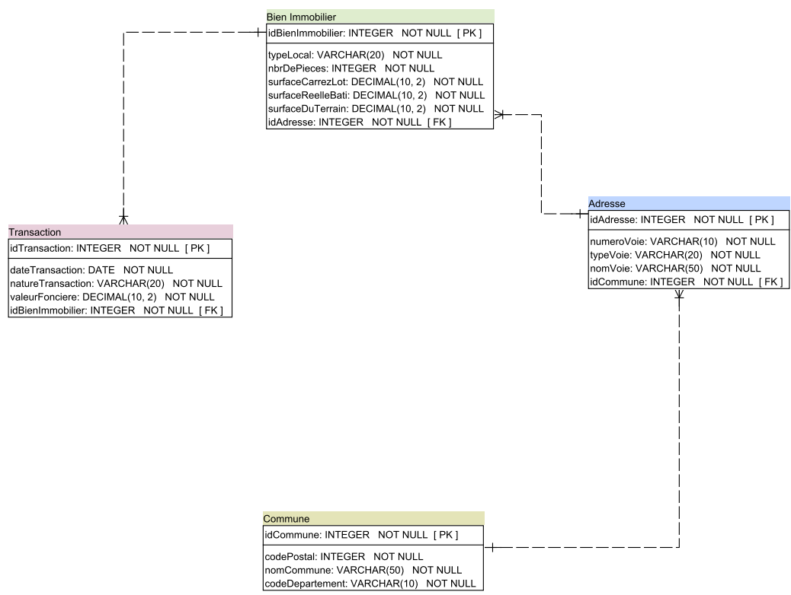

## Real estate Price in France

In this project, we built a real estate price forecast model in France with SQL.

We used [Requests for land values](https://www.data.gouv.fr/fr/datasets/5c4ae55a634f4117716d5656/) data from [Data.gouv](https://www.data.gouv.fr/fr/).

#

### Data dictionary

### Data cleaning

We used **Excel** and **Power Query** for data preparation

### Database Design
We used **Power Architect** to design the datase.

### The model
We used **MySQL** to implement the model

#

**Project Content**

1 Data dictionary.

1 Relational design patterns

1 script for tables in MySQL

1 script tables creation in PostgreSQL 

4 cleaned Data files.

9 MySQL queries
